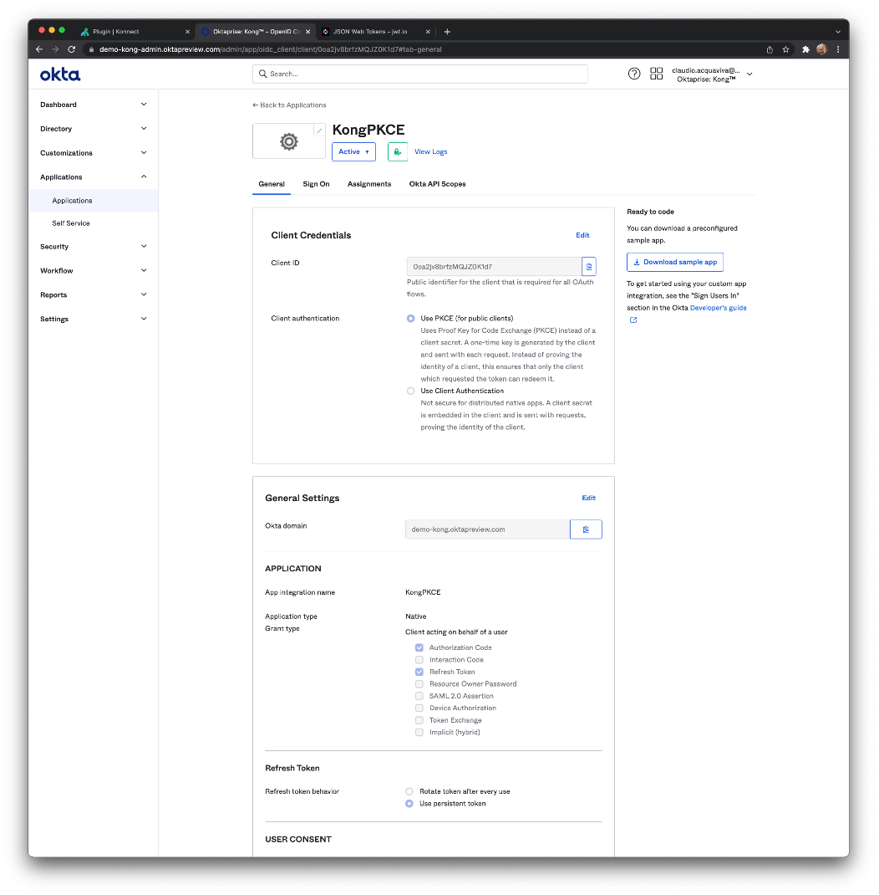

# Kong + Okta - Authorization Code + PKCE (Proof Key for Code Exchange) Demo Script

If you are building a native application, then the Authorization Code flow with a Proof Key for Code Exchange (PKCE) is the recommended method for controlling the access between your application and a resource server. The Authorization Code flow with PKCE is similar to the standard Authorization Code flow with an extra step at the beginning and an extra verification at the end. Please refer to this link to learn more about "[Authorization Code with PKCE](https://developer.okta.com/docs/guides/implement-grant-type/authcodepkce/main/)".


### Okta Application Creation

Login to Okta console again and click on "Applications" -> "Applications" -> "Create App Integration". Create a "OIDC - OpenID Connect" -> "Native Application". 


* For "App integration name" type "KongPKCE".
* Turn "Refresh Token" on
* For "Sign-in redirect URIs" type "http://a7e6a579326ec48c38020ca20d0fd990-217409592.eu-west-3.elb.amazonaws.com/httpbin2/get"
* For "Sign-out redirect URIs" type "http://a7e6a579326ec48c38020ca20d0fd990-217409592.eu-west-3.elb.amazonaws.com"
* Turn "Skip group assignment for now" on





Save the Client Id, we're going to use it to configure the Kong OIDC plugin. In our case, `0oa2jw2dn1knwPbaf1d7`


### Assign User to Application

Click on "Assignments" -> "Assign" -> "Assign to People". Choose an user and click on "Save and Go Back". Click on "Done" again.


### kong_oidc.yaml


```
_format_version: "0.1"
service_packages:
- name: httpbinservice
  versions:
  - implementation:
      kong:
        service:
          connect_timeout: 60000
          host: httpbin.org
          id: 00000000-0000-0000-0000-000000000000
          port: 80
          protocol: http
          read_timeout: 60000
          retries: 5
          routes:
          - https_redirect_status_code: 426
            name: httpbinroute
            path_handling: v0
            paths:
            - /httpbin
            plugins:
            - config:
                minute: 5
              enabled: true
              name: rate-limiting
            - config:
                cache_ttl: 30
                strategy: memory
              enabled: true
              name: proxy-cache
            - config:
                cache_ttl: 10
                issuer: https://demo-kong.oktapreview.com/oauth2/default
                scopes:
                - scope1
              enabled: true
              name: openid-connect
            preserve_host: false
            request_buffering: true
            response_buffering: true
            strip_path: true
          - https_redirect_status_code: 426
            name: httpbinroute2
            path_handling: v1
            paths:
            - /httpbin2
            plugins:
            - config:
                client_id: [0oa2jw2dn1knwPbaf1d7]
                auth_methods: [authorization_code]
                issuer: https://demo-kong.oktapreview.com/oauth2/default
                token_endpoint_auth_method: none
              enabled: true
              name: openid-connect
            preserve_host: false
            request_buffering: true
            response_buffering: true
            strip_path: true
          write_timeout: 60000
      type: kong-gateway
    version: v1
```


### Consume the Route

Redirect your browser to: 


```
http://a7e6a579326ec48c38020ca20d0fd990-217409592.eu-west-3.elb.amazonaws.com/httpbin2/get
```


Since you don't have an Identity Token, the Gateway will redirect you to Okta to get authenticated.


Enter with the right credentials. After authentication, Okta will redirect you to the API Gateway with the Id Token injected inside the request.


# 


# Kong + Okta - Access Control Demo Script


### Create a new Group

Click on "Directory" -> "Groups" -> "Add Group":


### Create a new User

Click on "Directory" -> "People" -> "Add person":


Add the new User to the Group we've just created:


Assign the new user to the KongPKCE Application.


### Create a new Claim

Go to the "default" Authorization Server and create a new Claim:


### Testing Token Issuing

Click on "Security" -> "API" -> "default" Authorization Server" -> "Token Preview".  and use the original user. As the user does not belong to the group the token won't have the "group" claim.


If we use the just created User, the token will be issued with the "kong_claim":


### kong_oidc.yaml


```
_format_version: "0.1"
service_packages:
- name: httpbinservice
  versions:
  - implementation:
      kong:
        service:
          connect_timeout: 60000
          host: httpbin.org
          id: 00000000-0000-0000-0000-000000000000
          port: 80
          protocol: http
          read_timeout: 60000
          retries: 5
          routes:
          - https_redirect_status_code: 426
            name: httpbinroute
            path_handling: v0
            paths:
            - /httpbin
            plugins:
            - config:
                minute: 5
              enabled: true
              name: rate-limiting
            - config:
                cache_ttl: 30
                strategy: memory
              enabled: true
              name: proxy-cache
            - config:
                cache_ttl: 10
                issuer: https://demo-kong.oktapreview.com/oauth2/default
                scopes:
                - scope1
              enabled: true
              name: openid-connect
            preserve_host: false
            request_buffering: true
            response_buffering: true
            strip_path: true
          - https_redirect_status_code: 426
            name: httpbinroute2
            path_handling: v1
            paths:
            - /httpbin2
            plugins:
            - config:
                client_id: [0oa2jw2dn1knwPbaf1d7]
                auth_methods: [authorization_code]
                issuer: https://demo-kong.oktapreview.com/oauth2/default
                token_endpoint_auth_method: none
                groups_required: [kong]
              enabled: true
              name: openid-connect
            preserve_host: false
            request_buffering: true
            response_buffering: true
            strip_path: true
          write_timeout: 60000
      type: kong-gateway
    version: v1

deck konnect sync --konnect-email oktaprise-support@okta.com --konnect-password 'Kongkong1!' -s kong.yaml
```


### Consume the Route

Redirect your browser to "http://a7e6a579326ec48c38020ca20d0fd990-217409592.eu-west-3.elb.amazonaws.com/httpbin2/get" and use the original username that is not included in the "kong_group".


Since the user is not included in the "kong_group" we get a "Forbidden" error message"


### Consume the Route with the new Username

This time, we're going to use the new username we have previously included in the "kong_group"


Check the issued token:


