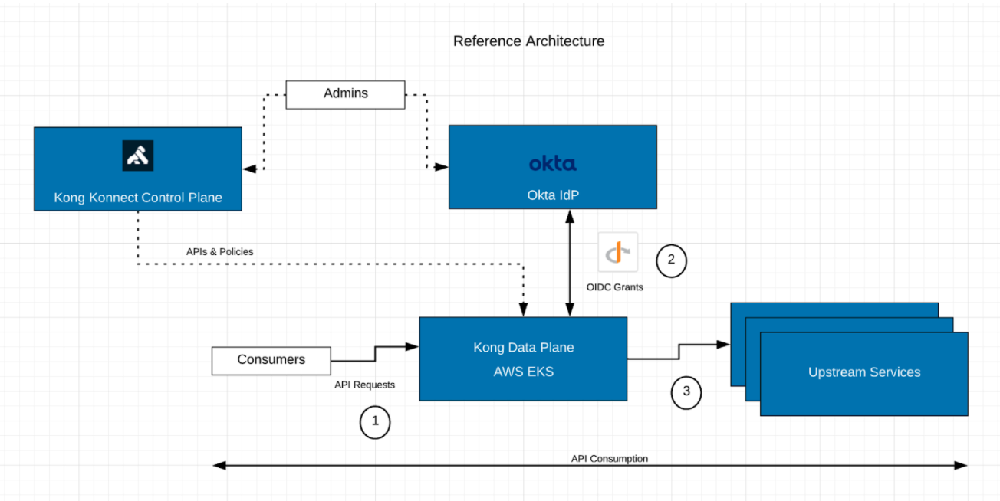

# Executive Summary

API gateway authentication is an important way to control the data that is allowed to be transmitted using your APIs. Basically, it checks that a particular consumer has permission to access the API, using a predefined set of credentials.

Kong Gateway has a library of plugins that provide simple ways to implement the best known and most widely used methods of API gateway authentication. Here are some of the commonly used ones:

* Basic Authentication
* Key Authentication
* OAuth 2.0 Authentication
* LDAP Authentication Advanced
* OpenID Connect

Get more information about [API Gateway authentication](https://konghq.com/learning-center/api-gateway/api-gateway-authentication/)

### OpenID Connect

Of all authentication mechanisms listed before, OpenID Connect (OIDC) is the preferred one for advanced requirements. In fact, when applying OIDC to secure the APIs, we're delegating the Authentication process to an external entity, called Identity Provider.

OIDC is a standard built on top of OAuth and JWT (JSON Web Token). Please, refer to the following link to learn more about OAuth/OIDC and its Flows: [https://developer.okta.com/docs/concepts/oauth-openid/](https://developer.okta.com/docs/concepts/oauth-openid/)

* Authorization Code
* Implicit
* Resource Owner Password
* Client Credentials

Here's the typical Authorization Code Flow:

1. Consumer provides a credential to the Identity Provide (IdP). If the Consumer sends a request to the API Gateway, since it doesn't include any token, the Gateway should redirect the Consumer to the IdP, again, to provide credentials.
2. IdP takes the credential to authenticate the Consumer using specific User Databases.
3. IdP issues the Authorization Code
4. IdP redirects the Consumer back to the API Gateway.
5. The API Gateway connects to IdP with the Authorization Code and gets the token
6. The API Gateway validates the token and passes the request to the Upstream Services.

It's important to notice that one of the main benefits provided by architecture like this is to follow the Separation of Concerns principle:

* Identity Provider: responsible for User and Application Authentication, Tokenization, MFA, multiples User Databases abstraction, etc.
* API Gateway: responsible for exposing the Upstream Services and controlling their consumption through an extensive list of policies besides Authentication including Rate Limiting, Caching, Log Processing, etc.

### Kong Konnect Enterprise and Okta

This document describes how to configure both Kong Konnect Enterprise and Okta to implement basic OIDC flows including:

* Client Credentials
* Authorization Code
* Access Control

The following diagram shows a Reference Architecture including Kong Konnect Enterprise and Okta

# Kong and Okta Demo Environment Control Planes

To get access to both Control Planes please use the following links:

### Okta

[https://demo-kong.oktapreview.com/](https://demo-kong.oktapreview.com/)

### Kong

[http://konnect.konghq.com](http://konnect.konghq.com)

UID: oktaprise-support@okta.com

# Next Steps

[Kong Konnect Data Plane](https://github.com/Kong/kong-okta/blob/main/KongOkta-SharedDemo/Kong%20Konnect%20Data%20Plane/Kong%20Konnect%20Data%20Plane.md)
