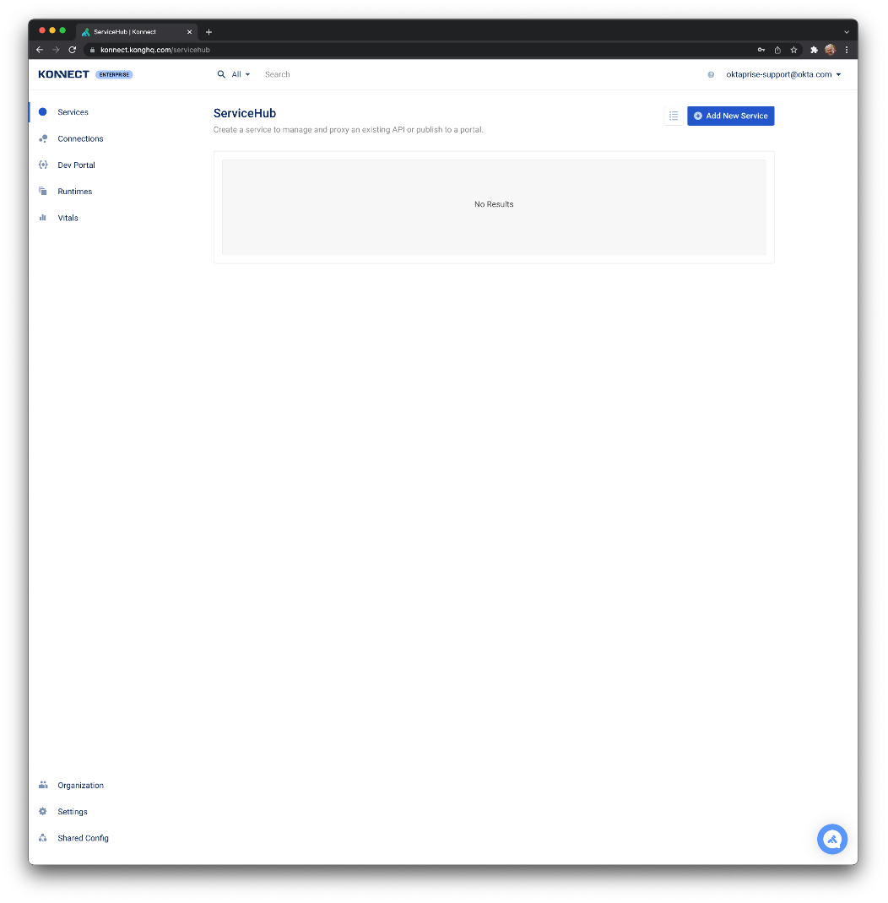
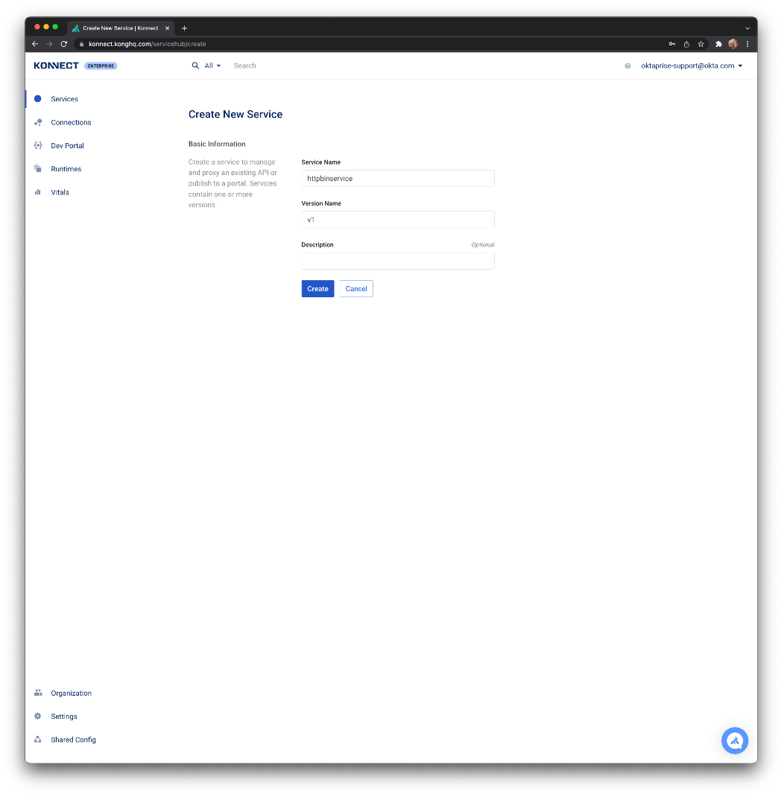
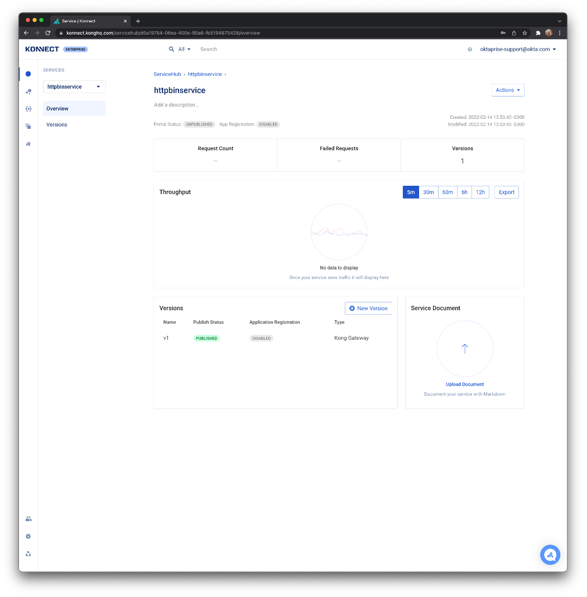
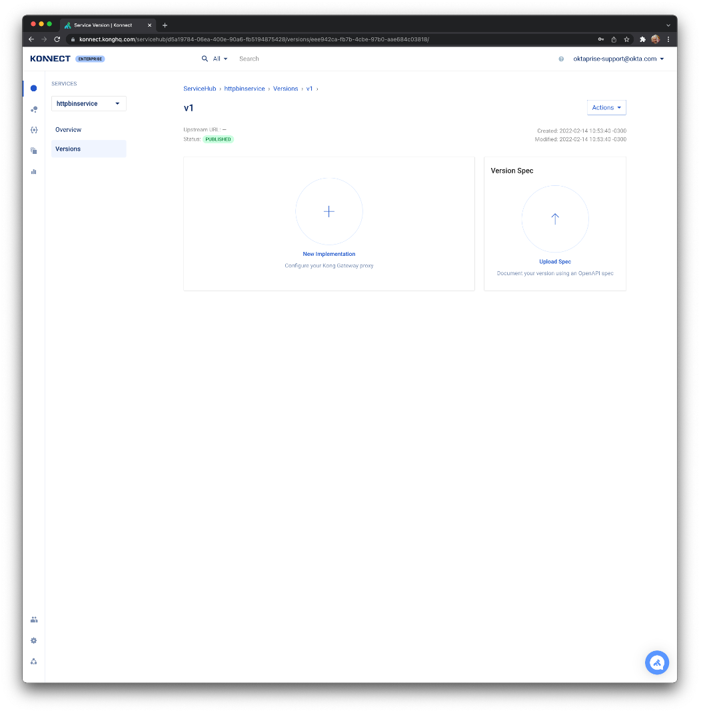
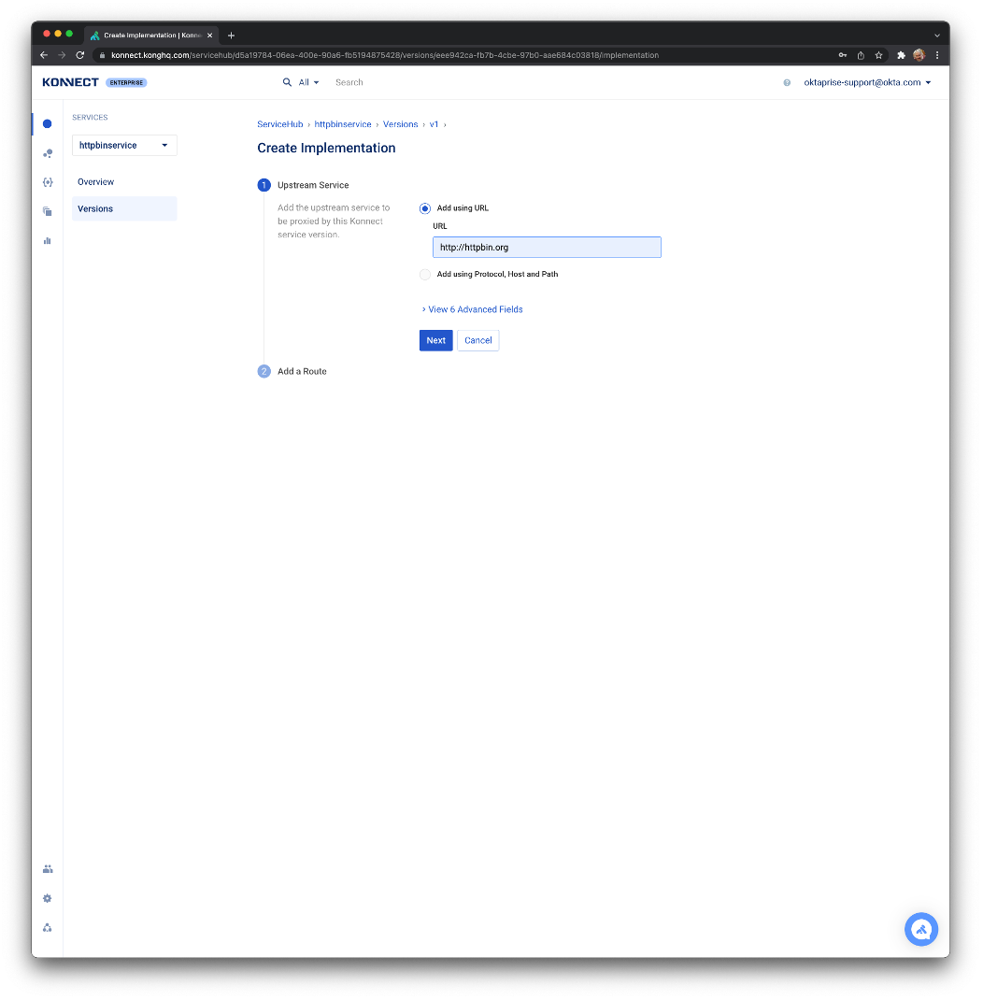
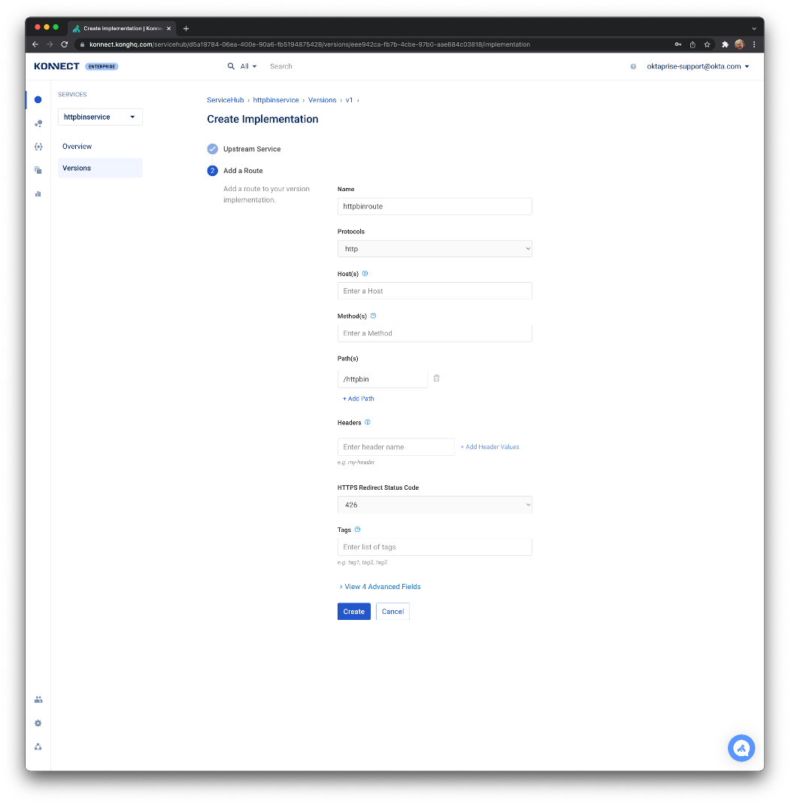
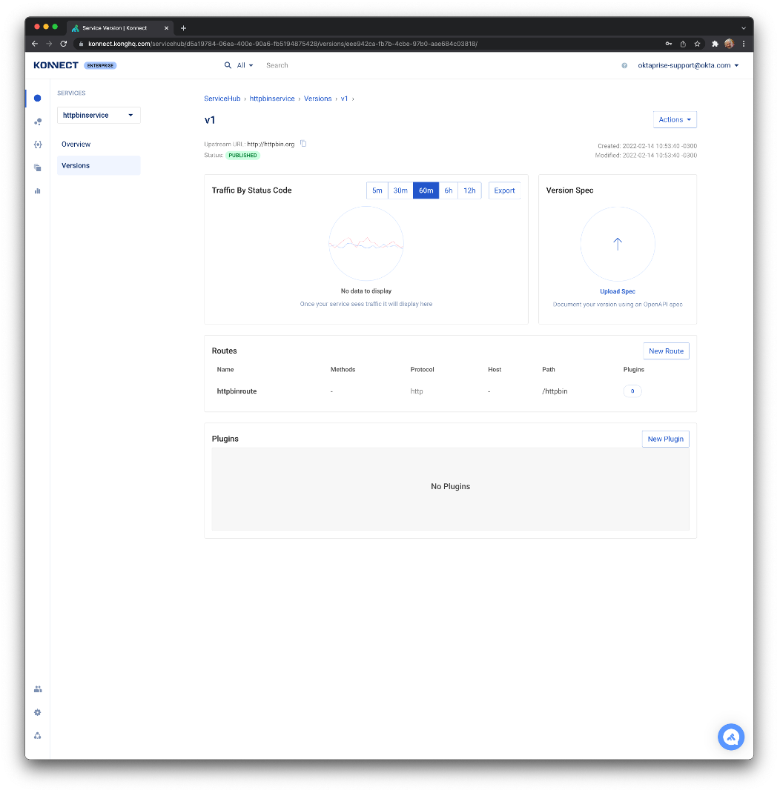
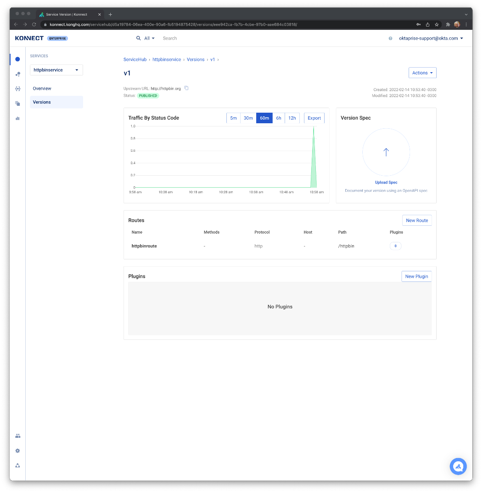
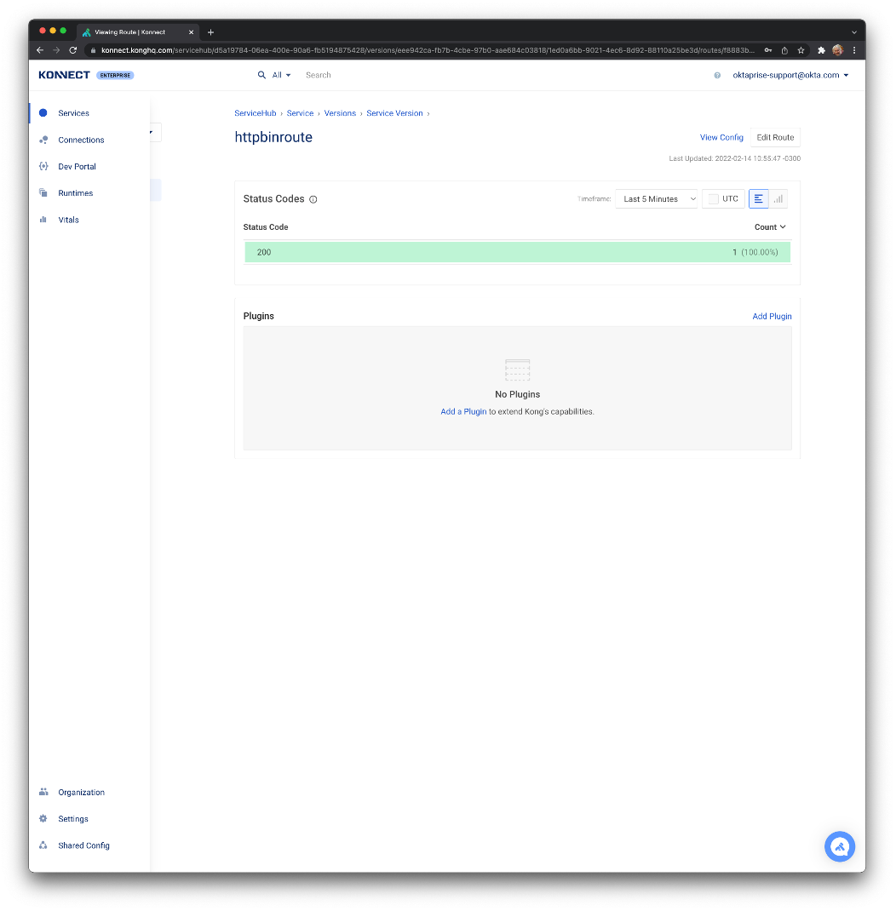

# Kong Service and Route Creation


## Create the Service Package

Login to Konnect and click on "Add New Service"




Create a new "httpbinservice" Service with "v1" version




Click on "Create"





### Create the Service's Implementation

Click on version "v1"




Click on "New Implementation"




Type "http://httpbin.org" for URL and click on "Next"




Type "httpbinroute" for Name. Click on "+ Add Path" and type "/httpbin". Click on "Create".




### Consume the Kong Route

Open a local terminal and send a request to the Data Plane using the AWS ELB already provisioned:


```
$ kubectl get service kong-dp-kong-proxy -n kong-dp -o json | jq -r .status.loadBalancer.ingress[].hostname
aa028f3bf482240a1b02280e14647be2-1862770018.us-east-1.elb.amazonaws.com

$ http aa028f3bf482240a1b02280e14647be2-1862770018.us-east-1.elb.amazonaws.com/httpbin/get
HTTP/1.1 200 OK
Access-Control-Allow-Credentials: true
Access-Control-Allow-Origin: *
Connection: keep-alive
Content-Length: 551
Content-Type: application/json
Date: Mon, 14 Feb 2022 13:57:46 GMT
Server: gunicorn/19.9.0
Via: kong/2.7.1.1-enterprise-edition
X-Kong-Proxy-Latency: 15
X-Kong-Upstream-Latency: 172

{
    "args": {},
    "headers": {
        "Accept": "*/*",
        "Accept-Encoding": "gzip, deflate",
        "Host": "httpbin.org",
        "User-Agent": "HTTPie/3.0.2",
        "X-Amzn-Trace-Id": "Root=1-620a5fda-39b8f04d6d00667c6dc0549d",
        "X-Forwarded-Host": "a7e6a579326ec48c38020ca20d0fd990-217409592.eu-west-3.elb.amazonaws.com",
        "X-Forwarded-Path": "/httpbin/get",
        "X-Forwarded-Prefix": "/httpbin"
    },
    "origin": "192.168.66.146, 15.236.158.176",
    "url": "http://a7e6a579326ec48c38020ca20d0fd990-217409592.eu-west-3.elb.amazonaws.com/get"
}
```


Show the Konnect Traffic Dashboard:




## 


## Rate Limiting Policy

As you can see the API has been exposed and can be consumed as many times as we want. Now it is time to define policies to control the exposure. The first policy we are going to create is Rate Limiting.


### Enable the Rate Limiting plugin to the Route

Generally speaking, a plugin can be enabled to specific objects like Services, Routes and Consumers or globally. Check the documentation for more information: [https://docs.konghq.com/konnect/manage-plugins/](https://docs.konghq.com/konnect/manage-plugins/)

Click on the Route "httpbinroute"




Click on "Add a Plugin"


<p id="gdcalert12" ><span style="color: red; font-weight: bold">>>>>>  gd2md-html alert: inline image link here (to images/image12.png). Store image on your image server and adjust path/filename/extension if necessary. </span><br>(<a href="#">Back to top</a>)(<a href="#gdcalert13">Next alert</a>)<br><span style="color: red; font-weight: bold">>>>>> </span></p>


Scroll down to the "Traffic Control" section:


<p id="gdcalert13" ><span style="color: red; font-weight: bold">>>>>>  gd2md-html alert: inline image link here (to images/image13.png). Store image on your image server and adjust path/filename/extension if necessary. </span><br>(<a href="#">Back to top</a>)(<a href="#gdcalert14">Next alert</a>)<br><span style="color: red; font-weight: bold">>>>>> </span></p>


Click on "Rate Limiting":


<p id="gdcalert14" ><span style="color: red; font-weight: bold">>>>>>  gd2md-html alert: inline image link here (to images/image14.png). Store image on your image server and adjust path/filename/extension if necessary. </span><br>(<a href="#">Back to top</a>)(<a href="#gdcalert15">Next alert</a>)<br><span style="color: red; font-weight: bold">>>>>> </span></p>


For the "Config.Minute" parameter type 5 and for "config.policy" choose "local". Click on "Create".


<p id="gdcalert15" ><span style="color: red; font-weight: bold">>>>>>  gd2md-html alert: inline image link here (to images/image15.png). Store image on your image server and adjust path/filename/extension if necessary. </span><br>(<a href="#">Back to top</a>)(<a href="#gdcalert16">Next alert</a>)<br><span style="color: red; font-weight: bold">>>>>> </span></p>


As you can see we can define Rate Limiting policies by minute, hour and month. An external Redis infrastructure can be used to share the Rate Limiting counters across multiple Data Plane instances. Please check the Rate Limiting plugin page for more information: [https://docs.konghq.com/hub/kong-inc/rate-limiting/](https://docs.konghq.com/hub/kong-inc/rate-limiting/)


### Consume the Kong Route again

Send a new request to the Data Plane. As you can see new Headers have been added to the response showing the Rate Limiting policy status:


```
$ http aa028f3bf482240a1b02280e14647be2-1862770018.us-east-1.elb.amazonaws.com/httpbin/get
HTTP/1.1 200 OK
Access-Control-Allow-Credentials: true
Access-Control-Allow-Origin: *
Connection: keep-alive
Content-Length: 551
Content-Type: application/json
Date: Mon, 14 Feb 2022 14:24:35 GMT
RateLimit-Limit: 5
RateLimit-Remaining: 4
RateLimit-Reset: 25
Server: gunicorn/19.9.0
Via: kong/2.7.1.1-enterprise-edition
X-Kong-Proxy-Latency: 28
X-Kong-Upstream-Latency: 166
X-RateLimit-Limit-Minute: 5
X-RateLimit-Remaining-Minute: 4

{
    "args": {},
    "headers": {
        "Accept": "*/*",
        "Accept-Encoding": "gzip, deflate",
        "Host": "httpbin.org",
        "User-Agent": "HTTPie/3.0.2",
        "X-Amzn-Trace-Id": "Root=1-620a6623-75a05eef1229ef755b5821dd",
        "X-Forwarded-Host": "a7e6a579326ec48c38020ca20d0fd990-217409592.eu-west-3.elb.amazonaws.com",
        "X-Forwarded-Path": "/httpbin/get",
        "X-Forwarded-Prefix": "/httpbin"
    },
    "origin": "192.168.66.146, 15.236.158.176",
    "url": "http://a7e6a579326ec48c38020ca20d0fd990-217409592.eu-west-3.elb.amazonaws.com/get"
}
```


Since we have defined a 5-request a minute policy, you should receive a specific 429 error code when trying to send more requests.


```
$ http aa028f3bf482240a1b02280e14647be2-1862770018.us-east-1.elb.amazonaws.com/httpbin/get
HTTP/1.1 429 Too Many Requests
Connection: keep-alive
Content-Length: 41
Content-Type: application/json; charset=utf-8
Date: Mon, 14 Feb 2022 14:24:46 GMT
RateLimit-Limit: 5
RateLimit-Remaining: 0
RateLimit-Reset: 14
Retry-After: 14
Server: kong/2.7.1.1-enterprise-edition
X-Kong-Response-Latency: 0
X-RateLimit-Limit-Minute: 5
X-RateLimit-Remaining-Minute: 0

{
    "message": "API rate limit exceeded"
}
```


## 


## Proxy Caching Policy

The second policy we are going to create is the Proxy Caching to get better performance and reduce latency times.


### Enable the Proxy Caching plugin to the Route

For the same Route we're going to enable the new policy based on the Proxy Caching plugin.

Click on the Route "httpbinroute" again:


<p id="gdcalert16" ><span style="color: red; font-weight: bold">>>>>>  gd2md-html alert: inline image link here (to images/image16.png). Store image on your image server and adjust path/filename/extension if necessary. </span><br>(<a href="#">Back to top</a>)(<a href="#gdcalert17">Next alert</a>)<br><span style="color: red; font-weight: bold">>>>>> </span></p>


Click on "Add Plugin". Scroll down to the "Traffic Control" section again and choose the "Proxy Caching" plugin:


<p id="gdcalert17" ><span style="color: red; font-weight: bold">>>>>>  gd2md-html alert: inline image link here (to images/image17.png). Store image on your image server and adjust path/filename/extension if necessary. </span><br>(<a href="#">Back to top</a>)(<a href="#gdcalert18">Next alert</a>)<br><span style="color: red; font-weight: bold">>>>>> </span></p>


Similarly to what we did before, we are going to set the Proxy Caching plugin with its specific parameters. For example, for "Config.Cache Ttl" parameter type 30 and for "Config.Strategy" choose "memory.

Check the Proxy Caching Plugin page for more information about it: [https://docs.konghq.com/hub/kong-inc/proxy-cache/](https://docs.konghq.com/hub/kong-inc/proxy-cache/)


<p id="gdcalert18" ><span style="color: red; font-weight: bold">>>>>>  gd2md-html alert: inline image link here (to images/image18.png). Store image on your image server and adjust path/filename/extension if necessary. </span><br>(<a href="#">Back to top</a>)(<a href="#gdcalert19">Next alert</a>)<br><span style="color: red; font-weight: bold">>>>>> </span></p>


### Consume the Kong Route again

Send a new request to the Data Plane. Besides the Rate Limiting Headers, our response shows the Proxy Caching Status. The Status says the Gateway didn't have any data available to satisfy the request, so it had to go to the Upstream.


```
$ http aa028f3bf482240a1b02280e14647be2-1862770018.us-east-1.elb.amazonaws.com/httpbin/get
HTTP/1.1 200 OK
Access-Control-Allow-Credentials: true
Access-Control-Allow-Origin: *
Connection: keep-alive
Content-Length: 551
Content-Type: application/json
Date: Mon, 14 Feb 2022 14:50:33 GMT
RateLimit-Limit: 5
RateLimit-Remaining: 4
RateLimit-Reset: 27
Server: gunicorn/19.9.0
Via: kong/2.7.1.1-enterprise-edition
X-Cache-Key: 0de290ec1f2998c47e44881248bf3136
X-Cache-Status: Miss
X-Kong-Proxy-Latency: 23
X-Kong-Upstream-Latency: 166
X-RateLimit-Limit-Minute: 5
X-RateLimit-Remaining-Minute: 4

{
    "args": {},
    "headers": {
        "Accept": "*/*",
        "Accept-Encoding": "gzip, deflate",
        "Host": "httpbin.org",
        "User-Agent": "HTTPie/3.0.2",
        "X-Amzn-Trace-Id": "Root=1-620a6c39-76474f1d60fc17230786ec0e",
        "X-Forwarded-Host": "a7e6a579326ec48c38020ca20d0fd990-217409592.eu-west-3.elb.amazonaws.com",
        "X-Forwarded-Path": "/httpbin/get",
        "X-Forwarded-Prefix": "/httpbin"
    },
    "origin": "192.168.66.146, 15.236.158.176",
    "url": "http://a7e6a579326ec48c38020ca20d0fd990-217409592.eu-west-3.elb.amazonaws.com/get"
}
```


For the second request, the Status says we got a "Hit" meaning that the Gateway had everything it needed to respond to the consumer. Moreover, the latency times are considerably reduced.


```
$ http aa028f3bf482240a1b02280e14647be2-1862770018.us-east-1.elb.amazonaws.com/httpbin/get
HTTP/1.1 200 OK
Access-Control-Allow-Credentials: true
Access-Control-Allow-Origin: *
Age: 9
Connection: keep-alive
Content-Length: 551
Content-Type: application/json
Date: Mon, 14 Feb 2022 14:50:33 GMT
RateLimit-Limit: 5
RateLimit-Remaining: 3
RateLimit-Reset: 27
Server: gunicorn/19.9.0
Via: kong/2.7.1.1-enterprise-edition
X-Cache-Key: 0de290ec1f2998c47e44881248bf3136
X-Cache-Status: Hit
X-Kong-Proxy-Latency: 0
X-Kong-Upstream-Latency: 0
X-RateLimit-Limit-Minute: 5
X-RateLimit-Remaining-Minute: 3

{
    "args": {},
    "headers": {
        "Accept": "*/*",
        "Accept-Encoding": "gzip, deflate",
        "Host": "httpbin.org",
        "User-Agent": "HTTPie/3.0.2",
        "X-Amzn-Trace-Id": "Root=1-620a6c39-76474f1d60fc17230786ec0e",
        "X-Forwarded-Host": "a7e6a579326ec48c38020ca20d0fd990-217409592.eu-west-3.elb.amazonaws.com",
        "X-Forwarded-Path": "/httpbin/get",
        "X-Forwarded-Prefix": "/httpbin"
    },
    "origin": "192.168.66.146, 15.236.158.176",
    "url": "http://a7e6a579326ec48c38020ca20d0fd990-217409592.eu-west-3.elb.amazonaws.com/get"
}
```


If we wait for 30 seconds, since it's been our TTL for the Caching, the Gateway will purge all data from the Cache and report a "Miss" again.


```
$ http aa028f3bf482240a1b02280e14647be2-1862770018.us-east-1.elb.amazonaws.com/httpbin/get
HTTP/1.1 200 OK
Access-Control-Allow-Credentials: true
Access-Control-Allow-Origin: *
Connection: keep-alive
Content-Length: 551
Content-Type: application/json
Date: Mon, 14 Feb 2022 14:52:27 GMT
RateLimit-Limit: 5
RateLimit-Remaining: 4
RateLimit-Reset: 33
Server: gunicorn/19.9.0
Via: kong/2.7.1.1-enterprise-edition
X-Cache-Key: 0de290ec1f2998c47e44881248bf3136
X-Cache-Status: Miss
X-Kong-Proxy-Latency: 9
X-Kong-Upstream-Latency: 165
X-RateLimit-Limit-Minute: 5
X-RateLimit-Remaining-Minute: 4

{
    "args": {},
    "headers": {
        "Accept": "*/*",
        "Accept-Encoding": "gzip, deflate",
        "Host": "httpbin.org",
        "User-Agent": "HTTPie/3.0.2",
        "X-Amzn-Trace-Id": "Root=1-620a6cab-526b5a9d04cdb3727d3bca1e",
        "X-Forwarded-Host": "a7e6a579326ec48c38020ca20d0fd990-217409592.eu-west-3.elb.amazonaws.com",
        "X-Forwarded-Path": "/httpbin/get",
        "X-Forwarded-Prefix": "/httpbin"
    },
    "origin": "192.168.66.146, 15.236.158.176",
    "url": "http://a7e6a579326ec48c38020ca20d0fd990-217409592.eu-west-3.elb.amazonaws.com/get"
}
```


### Next Steps

[Client Credentials](https://github.com/Kong/kong-okta/blob/main/KongOkta-SharedDemo/Client%20Credentials/Client%20Credentials.md)